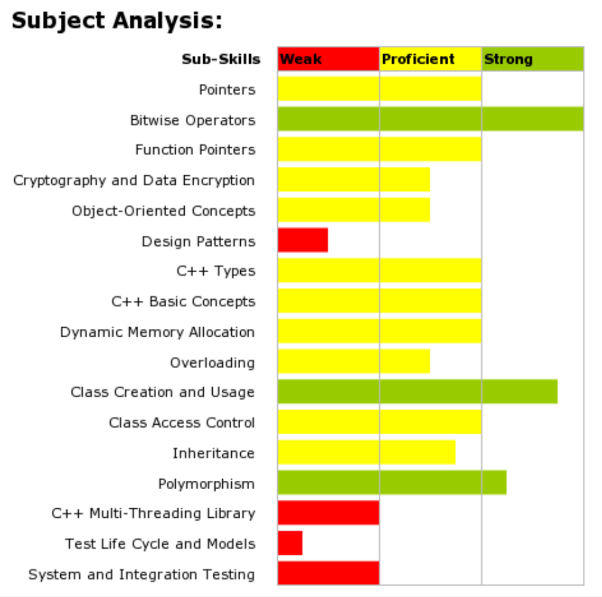

# To revise
* Design patterns
* Threading
* Test life cycle and models
* System and integration testing

* Big O
* Find a good spot for Skype

# Quiz / tutorials
* http://cpp-tip-of-the-day.blogspot.co.uk/
* http://www.learncpp.com/
* http://www.cplusplus.com/doc/tutorial/
* http://www.mycppquiz.com/question.php (31)

